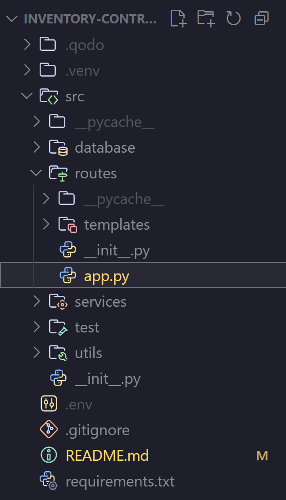

# inventory-control-software

## What is this project about?

Want to design a Web App to organize the inventory and differents finances stuff in any small business. 

---

## Technologies

Python (Flask) for Rest APIs 

Want to use React for front-end design and MySql for database.

Also want to use Json Web Tokens to Auth an admin user and employee user.

---

## Virtual Environment Guide 

> You must be located in the project file to create the virtual environment.

### Create Virtual Environment 

#### Linux

```python3 -m venv .venv```

#### Windows

```python -m venv .venv```

### Activate Virtual Environment 

> To avoid errors you must call your virtual environment ".venv".

#### Windows
```.\.venv\Scripts\activate```

#### Linux 
```source .venv/bin/activate```

---

## Directory Structure 



**NOTE**: All directories containing Python modules must include an ```__init__.py``` file for the project's correct packaging and functionality.

---

## Database

If you are working on a Windows operating system, we strongly recommend using XAMPP. XAMPP provides a simple, all-in-one package for Apache, MariaDB (MySQL), making the database server setup quick and straightforward for local development. 

-----

### Database Setup: Cloning the Initial Data

These steps guide you through creating and populating your local database using the provided SQL file.

#### 1\. Crucial Database Naming

> **The database MUST be named `inventory_control_db`**. If you use a different name, the Python application will fail to connect.

#### 2\. Create the Database

First, create the empty database in your MySQL/MariaDB server:

```sql
CREATE DATABASE inventory_control_db;
```

#### 3\. Clone the Data

Now, use the `mysql` command to import all data from the SQL dump file, which is located in your project's `database` directory.

> **Note:** Execute this command from the root directory of your project.

```bash
mysql -u root -p inventory_control_db < src/database/inventory_control_db.sql
```

```windows
"C:\xampp\mysql\bin mysql" -u root -p inventory_control_db < "src/database/inventory_control_db.sql"
```

After running the command, you will be prompted for your MySQL root password.

-----

### Verification

If the command executes without errors, the database has been successfully cloned and populated with all necessary tables and data. You can now run the Flask application.

## How to run the code

1. Move to root directory ```inventory-control-software``` and execute the next command ```set FLASK_APP=src/routes/app.py```. 

2. Once did this, run this command ```flask run --debug```.


